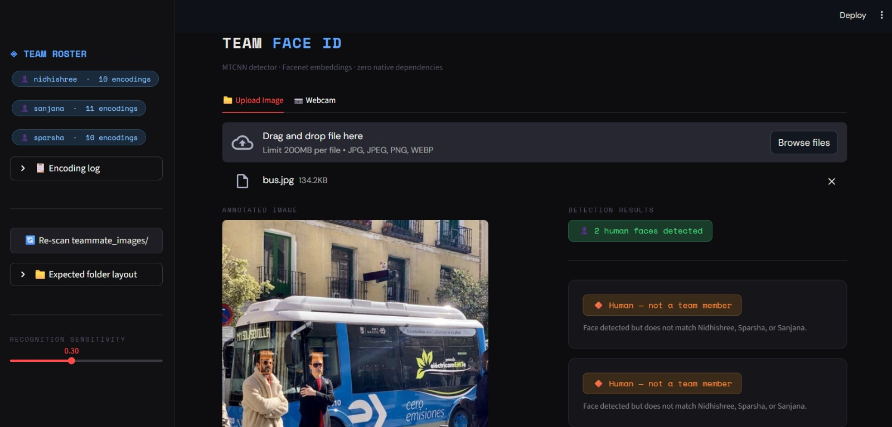

# Team Face ID 🔍

A face recognition system built with Streamlit that identifies team members from uploaded images or a live webcam snapshot. The system uses **MTCNN** for deep-learning-based face detection and **DeepFace (Facenet)** for face recognition.

---

## Screenshot



---

## Table of Contents

- [Features](#features)
- [How It Works](#how-it-works)
- [Project Structure](#project-structure)
- [Installation](#installation)
- [Dataset Setup](#dataset-setup)
- [Running the App](#running-the-app)
- [Usage Guide](#usage-guide)
- [Recognition Pipeline](#recognition-pipeline)
- [Configuration](#configuration)
- [Security & Privacy](#security--privacy)
- [Troubleshooting](#troubleshooting)
- [Tech Stack](#tech-stack)

---

## Features

- **Deep learning face detection** using MTCNN (Multi-task Cascaded Convolutional Networks) — no Haarcascade, no false positives from textures
- **Face recognition** using Facenet 128-d embeddings via DeepFace — no `dlib`, no CMake, no C++ build tools required
- **Rotation-aware detection** — automatically tries 0°, 90°, 270°, 180° to detect faces in rotated images
- **EXIF auto-correction** — handles phone photos that embed rotation in metadata
- **False positive rejection** — multi-layer guard system (confidence, face size, eye landmark sanity) prevents plants, textures, and medical scans from being misidentified
- **Smart caching** — face encodings are cached to disk on first run; subsequent startups are instant. Cache auto-invalidates if the dataset changes
- **Two input modes** — upload an image file or take a live webcam snapshot
- **Three recognition outcomes:**
  - ⚠️ Not a human — no face detected
  - 🔶 Human, but not a team member
  - ✅ Team member found — displays name and match confidence

---

## How It Works

```
Input Image / Webcam Snapshot
        │
        ▼
┌─────────────────────────────┐
│  EXIF Rotation Correction   │  PIL ImageOps.exif_transpose
└─────────────┬───────────────┘
              │
        ┌─────▼──────┐
        │ Try angles │  0° → 90° → 270° → 180°
        └─────┬──────┘
              │
┌─────────────▼───────────────┐
│     MTCNN Face Detection    │  Confidence ≥ 0.90
│  + Multi-layer FP Guards    │  Min face size, eye separation
└─────────────┬───────────────┘
              │
       No face found?
       └──→ "Not a Human"
              │
┌─────────────▼───────────────┐
│   DeepFace Facenet Embed    │  128-dimensional face vector
└─────────────┬───────────────┘
              │
┌─────────────▼───────────────┐
│   Cosine Distance Match     │  vs all stored embeddings
│   against team_encodings    │  threshold ≤ 0.30
└─────────────┬───────────────┘
              │
     ┌────────┴────────┐
     │                 │
  Match found      No match
  "Team Member"    "Not a Team Member"
```

---

## Project Structure

```
teamRecognition/
├── app.py                   # Main Streamlit application
├── requirements.txt         # Python dependencies
├── .gitignore               # Excludes dataset, encodings, venv
│
├── teammate_images/         # ⚠ NOT in git — biometric data
│   ├── nidhishree/
│   │   ├── 01.jpg
│   │   └── ...             (10 images recommended)
│   ├── sparsha/
│   │   └── ...
│   └── sanjana/
│       └── ...
│
└── team_encodings.pkl       # ⚠ NOT in git — auto-generated cache
```

---

## Installation

### Prerequisites

- Python 3.10, 3.11, or 3.12
- pip

### Steps

```bash
# 1. Clone the repository
git clone https://github.com/your-username/teamRecognition.git
cd teamRecognition

# 2. Create and activate a virtual environment
python -m venv venv

# Windows
venv\Scripts\activate

# macOS / Linux
source venv/bin/activate

# 3. Install dependencies
pip install -r requirements.txt
```

> **Note:** On first run, DeepFace will automatically download the Facenet model weights (~90 MB). This happens once and is cached locally.

---

## Dataset Setup

The dataset is **not included in this repository** for privacy reasons. You must provide it manually.

Create the following folder structure next to `app.py`:

```
teammate_images/
├── <member_name>/
│   ├── photo1.jpg
│   ├── photo2.jpg
│   └── ...
├── <member_name>/
│   └── ...
└── <member_name>/
    └── ...
```

**Guidelines for best accuracy:**

| Tip | Why it matters |
|-----|---------------|
| Use 5–10 photos per person | More encodings = more robust matching |
| Vary angles (front, slight left/right) | Improves recognition across poses |
| Vary lighting conditions | Prevents lighting-dependent failures |
| Use clear, unobstructed face photos | Occluded faces may fail to encode |
| JPG or PNG format | Other formats also supported (WEBP, BMP) |

The folder name becomes the displayed member name — capitalisation is preserved exactly as typed.

---

## Running the App

```bash
streamlit run app.py
```

The app will open in your browser at `http://localhost:8501`.

**First launch:** The app scans `teammate_images/`, encodes all photos (approx. 30–60 seconds depending on dataset size), and saves `team_encodings.pkl`. All subsequent launches load from cache instantly.

**If you update the dataset** (add/remove/replace photos), click **🔄 Re-scan teammate_images/** in the sidebar to rebuild the cache.

---

## Usage Guide

### Upload Mode (`📁 Upload Image` tab)

1. Click **Browse files** or drag and drop an image (JPG, PNG, WEBP)
2. The system analyses the image and displays:
   - An annotated image with bounding boxes around detected faces
   - Detection result with team member name and match confidence (if recognised)

### Webcam Mode (`📷 Webcam` tab)

1. Click the camera widget — your browser will request camera permission
2. Position the face in frame and click the capture button
3. The snapshot is analysed immediately using the same pipeline

### Sidebar Controls

| Control | Description |
|---------|-------------|
| **Team Roster** | Shows all enrolled members and their encoding counts |
| **Encoding Log** | Expandable log showing per-image encoding results from last scan |
| **Re-scan** | Forces a full re-encode from the dataset folder |
| **Folder Layout** | Reference for expected directory structure |
| **Tolerance Slider** | Adjusts cosine distance threshold (0.10–0.60). Lower = stricter matching |

---

## Recognition Pipeline

### Face Detection (MTCNN)

MTCNN runs three convolutional network stages (P-Net, R-Net, O-Net) to progressively locate and refine face candidates. It is significantly more accurate than Haarcascade classifiers, especially for non-frontal faces, small faces, and varying lighting.

**False positive rejection guards (applied in order):**

1. **Confidence threshold** ≥ 0.90 — rejects low-certainty detections
2. **Minimum face size** ≥ 0.1% of image area — rejects noise hits and pixel-level artifacts
3. **Eye landmark separation** ≥ 8% of face width — rejects texture false positives (plants, fabric, CT scans) where MTCNN hallucinates landmarks with near-zero separation
4. **Image size guard** — skips images smaller than 80px in either dimension to prevent Conv2D crashes

**Rotation handling:**

The detector tries four rotations in order: `0° → 90° → 270° → 180°`. When a face is found at a non-zero angle, bounding box coordinates are mathematically transformed back to original image space for correct annotation drawing, while the rotated image is used for face cropping and embedding.

### Face Recognition (DeepFace + Facenet)

Each detected face is cropped, converted to BGR, and passed to DeepFace's `represent()` function using the **Facenet** model. This produces a 128-dimensional embedding vector representing the unique geometric features of the face.

Recognition is performed by computing the **cosine distance** between the query embedding and all stored embeddings:

```
cosine_distance(a, b) = 1 - dot(a/|a|, b/|b|)
```

The closest match is selected. If its distance is below the configured threshold (default `0.30`), the person is identified as a team member. Otherwise they are flagged as an unknown human.

### Caching

On first run, all dataset images are encoded and stored in `team_encodings.pkl` along with a SHA-1 fingerprint of the dataset folder (file paths + modification timestamps) and a cache version string. On subsequent runs, if the fingerprint and version match, encodings are loaded directly — skipping the encoding step entirely.

---

## Configuration

Key constants at the top of `app.py`:

| Constant | Default | Description |
|----------|---------|-------------|
| `DATASET_DIR` | `teammate_images` | Path to the dataset folder (relative to `app.py`) |
| `DB_PATH` | `team_encodings.pkl` | Path to the encoding cache file |
| `MODEL_NAME` | `"Facenet"` | DeepFace model used for embeddings |
| `MTCNN_CONF` | `0.90` | Minimum MTCNN detection confidence |
| `MIN_FACE_RATIO` | `0.001` | Minimum face area as fraction of image area |
| `MIN_EYE_SEP` | `0.08` | Minimum eye separation as fraction of face width |
| `COSINE_THRESHOLD` | `0.30` | Maximum cosine distance to accept a match |
| `CACHE_VERSION` | `"v2-rotation"` | Bump this string to force a full re-encode |

---

## Security & Privacy

> ⚠️ **This project handles biometric data. Please read this section carefully.**

### What is excluded from git

| File / Folder | Reason |
|---------------|--------|
| `teammate_images/` | Contains personal face photographs — biometric data |
| `team_encodings.pkl` | Contains 128-d face embedding vectors derived from biometric data |
| `venv/` | Local environment — not portable |

### Why encodings are sensitive

Face embedding vectors are not raw images, but they are biometric fingerprints. They can potentially be used to:

- Match a person against other face databases
- Reconstruct approximate facial geometry
- Perform re-identification attacks

**Treat `team_encodings.pkl` with the same sensitivity as a password file.** Do not commit it to any repository (public or private), share it over unencrypted channels, or store it in cloud storage without access controls.

### Recommendations

- Store `team_encodings.pkl` outside the project directory and reference it via an environment variable
- Restrict read access to the pkl file at the OS level (`chmod 600` on Linux/macOS)
- If deploying to a server, ensure the dataset and cache are on an encrypted volume
- Obtain explicit written consent from all individuals whose images are used

---

## Troubleshooting

**`Failed to build dlib` during install**
This project does not use `dlib`. If you see this error, ensure you are installing from `requirements.txt` and not a cached/old pip command.

**`ValueError: tf-keras package required`**
```bash
pip install tf-keras
```

**`No module named 'mtcnn'`**
```bash
pip install mtcnn
```

**App says "Not a human" for a clear face photo**
- Try lowering `MTCNN_CONF` to `0.88` in `app.py`
- Ensure the face occupies a reasonable portion of the image
- Check that the image is not heavily compressed or blurred

**Wrong bounding box position on rotated images**
- Delete `team_encodings.pkl` and restart the app to trigger a fresh encode with rotation correction

**Face detected but wrong person identified**
- Add more varied photos to that person's folder and click **Re-scan**
- Try raising the Tolerance slider slightly in the sidebar
- Ensure training photos are taken in similar lighting conditions to test images

**Webcam not working**
- Ensure your browser has granted camera permissions to `localhost`
- Try Chrome or Edge — Firefox may handle `st.camera_input` differently

---

## Tech Stack

| Component | Library | Version |
|-----------|---------|---------|
| Web UI | Streamlit | ≥ 1.35 |
| Face Detection | MTCNN | ≥ 0.1.1 |
| Face Recognition | DeepFace (Facenet) | ≥ 0.0.93 |
| Deep Learning Backend | TensorFlow + tf-keras | ≥ 2.13 |
| Image Processing | Pillow, OpenCV | ≥ 10.0, ≥ 4.8 |
| Numerical Computing | NumPy | ≥ 1.24 |

---

## Acknowledgements

- [MTCNN](https://github.com/ipazc/mtcnn) — Joint Face Detection and Alignment using Multi-task Cascaded Convolutional Networks
- [DeepFace](https://github.com/serengil/deepface) — Lightweight face recognition and facial attribute analysis framework
- [FaceNet](https://arxiv.org/abs/1503.03832) — Schroff et al., 2015 — A Unified Embedding for Face Recognition and Clustering

---

